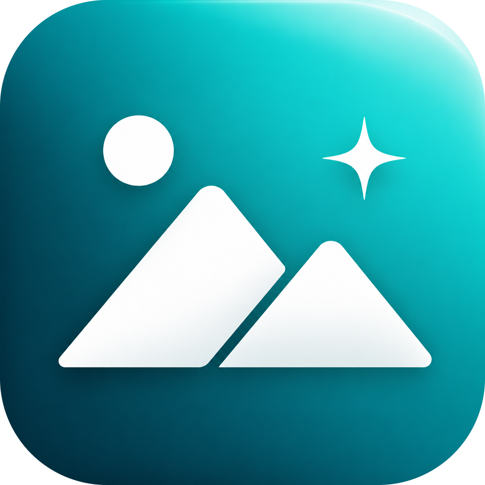

  

<h1 align="center">Keiga</h1>

  Lightweight image optimizer

  
  
  
  
  

Rust の勉強がてら、自分用に Image Optimization ってことで、Keiga（軽画）でも作ってみようと思って作成なぅ。

フォルダや画像をドロップすると、対応形式をその場で最適化します。元ファイルは上書きされます。

## Supported formats

最適化できるのは次の拡張子のみです。

| Extension | Optimization |
| --- | --- |
| `.jpg` / `.jpeg` | 非可逆（JPEG Quality で再エンコード） |
| `.png` | 可逆（[oxipng](https://github.com/oxipng/oxipng)） |

ダイアログには他の画像拡張子も表示されますが、最適化対象外は `Unsupported extension` になります。

## Usage

- フォルダまたはファイルを **ドラッグ＆ドロップ**
- 右上のフォルダボタンから開く（macOS はファイルとフォルダを同時選択可）

追加されたファイルは待機（standby）から順に自動で最適化されます。

## Mouse & keyboard

一覧の行を対象にした操作です。

| Input | Behavior |
| --- | --- |
| Click | 行を選択 |
| Click on empty area | 選択を解除 |
| Double-click | Finder / Explorer でファイルの場所を表示 |
| <kbd>Backspace</kbd> | 選択中の最適化をキャンセル（最適化済みは対象外） |
| <kbd>Space</kbd> | [Quick Look](https://support.apple.com/guide/mac-help/mchlp1119/mac) でプレビュー（**macOS のみ**） |

右下のクリアボタンは、実行中の最適化を止めて一覧を空にします。

## Settings

歯車アイコンから、並行処理数・JPEG Quality・PNG Preset を変更できます。

## License

[Apache-2.0](https://github.com/yoshitaka-k/keiga/blob/main/LICENSE)
